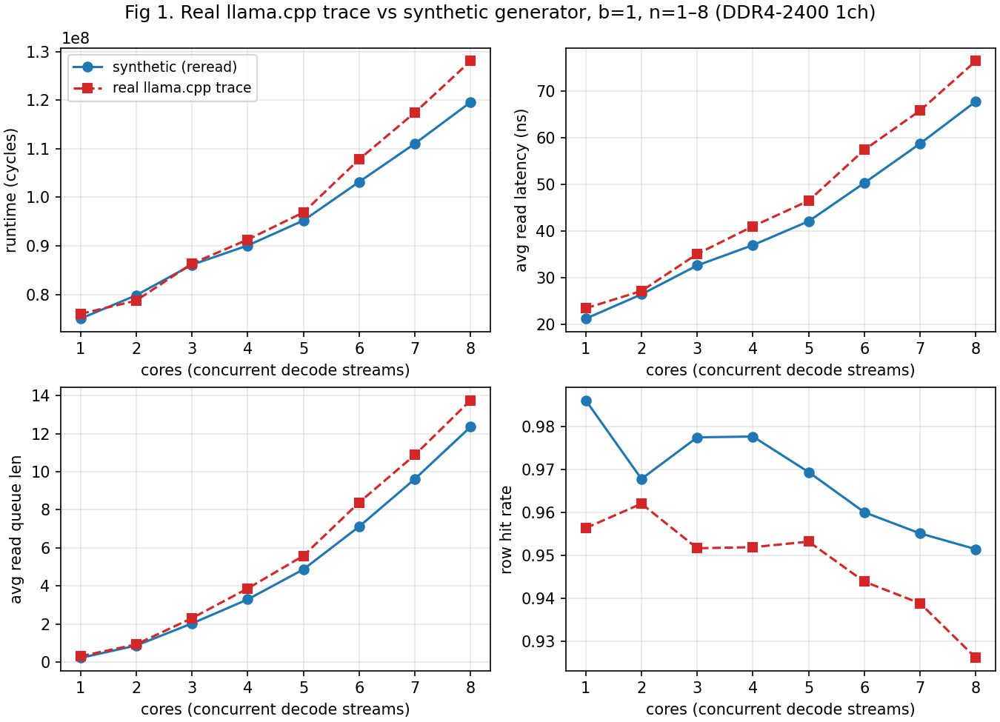
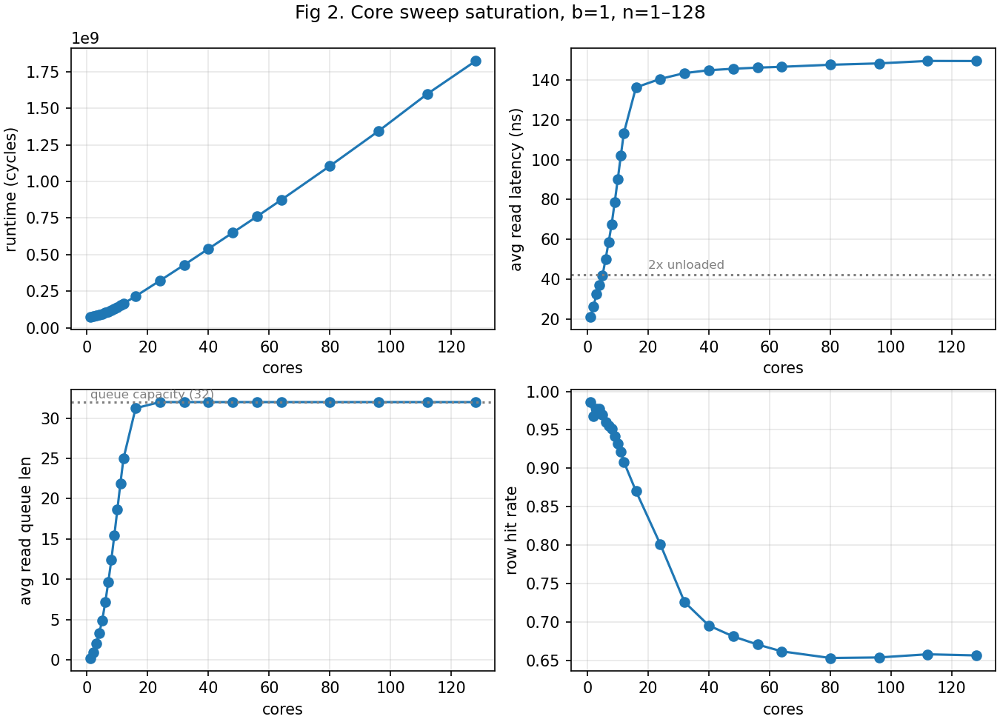
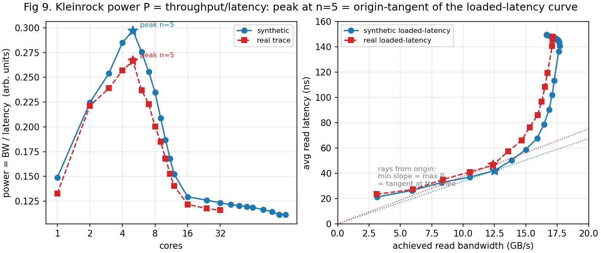
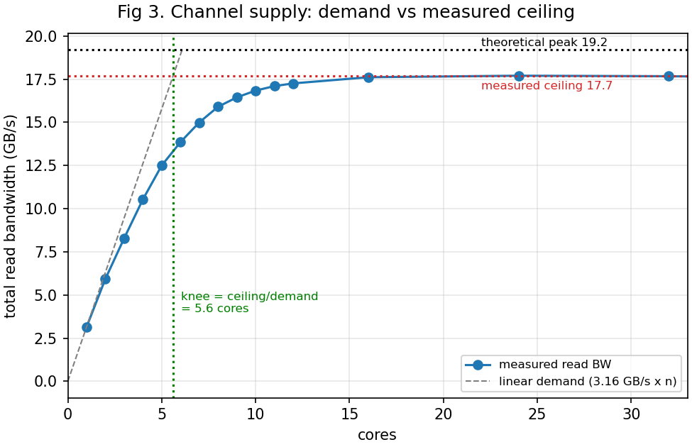
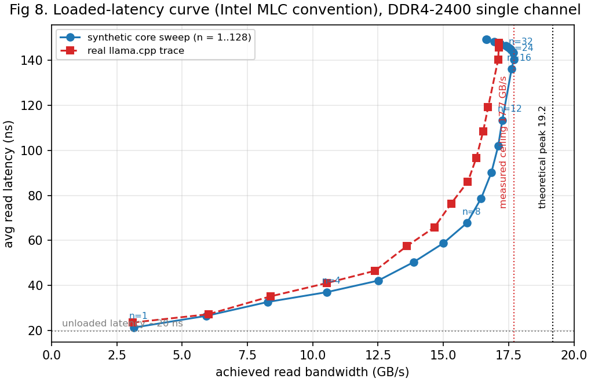
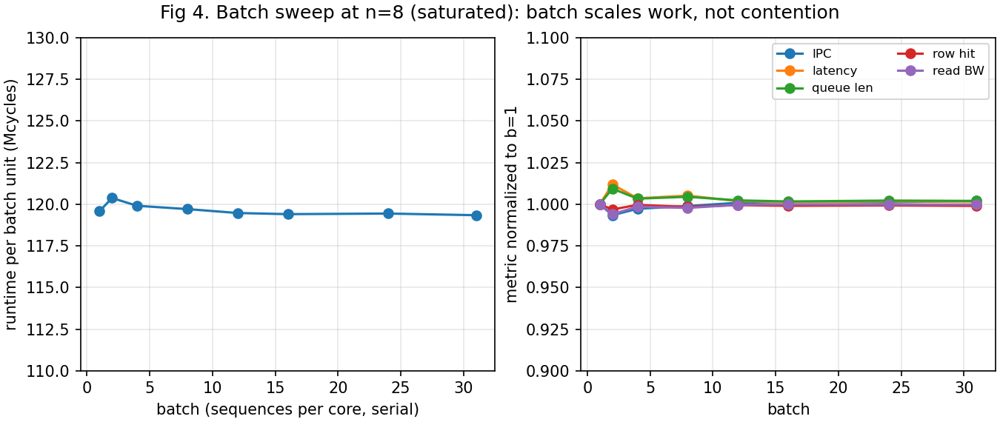
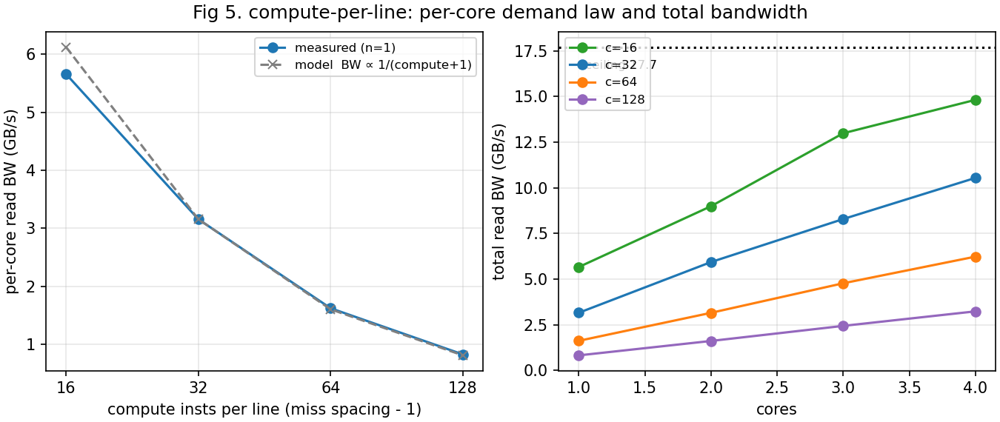
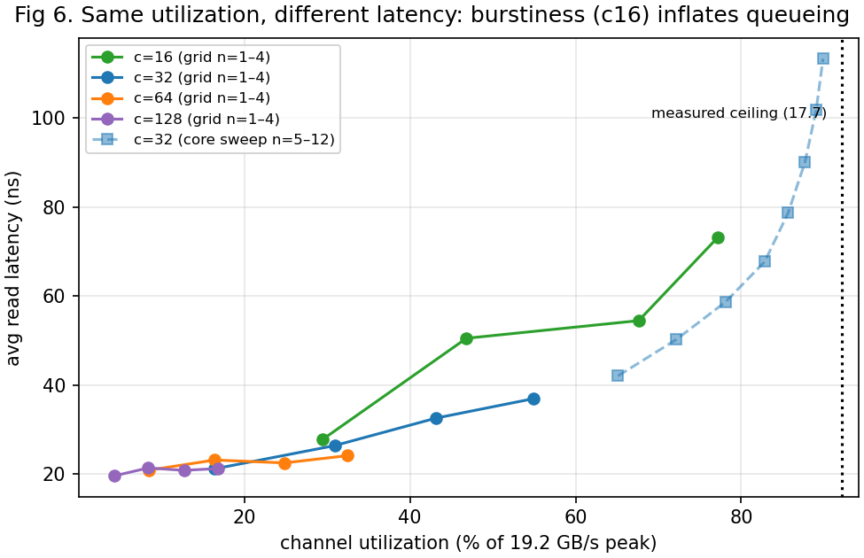
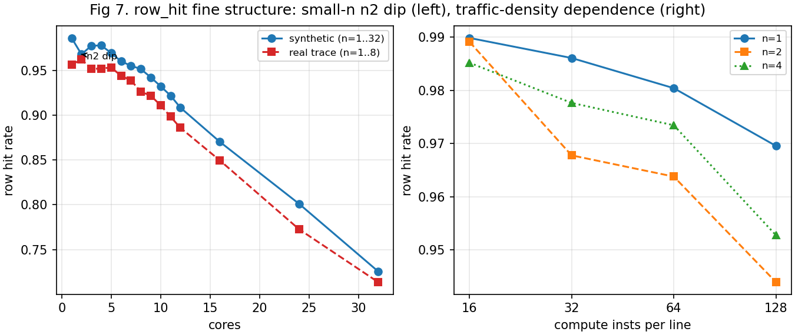

# LLM KV-Decode 메모리 동작: DDR4 단일 채널에서의 동시성·포화 분석

**테크 리포트** · 2026-06-11, rev. 2026-06-16 (UTC) · `/home/mem-study`
대상 데이터: 정식 sweep 결과 4종 (reread 세대; naive 아카이브 제외).

---

## 0. 요약 (TL;DR)

Llama-3.1-8B 형상의 decode-시 KV-cache 트래픽을 instrumented llama.cpp 실측 트레이스로 검증된
합성 트레이스 generator로 만들어, Ramulator 2.1 (SimpleO3 + DDR4-2400R 단일 채널)에서
동시성(core)·배치(batch)·연산밀도(compute-per-line) 3개 축을 sweep했다. 핵심 결론:

1. **합성 트레이스가 실측을 정량 재현한다** — runtime 오차 n1/n2/n4 = ±1.4%, n8 = −6.6%. [F1]
2. **decode 스트림 1개의 DRAM 수요는 3.16 GB/s** (real-trace-in-sim 3.11; 하드웨어 실측은
   §6 caveat), 채널 공급은 **n≈24에서 피크 ~17.7 GB/s (이론 피크 19.2의 92%)**. 따라서
   **채널당 동시 decode 스트림 한계는 ~5개**다 — 스터디의 포화 정의인 Kleinrock power(throughput/latency)가
   **n5**에서 정점이고(F2, fig9), latency-2× 보간(5.0)·ceiling/demand(5.6)도 같은 곳을 가리킨다. n≈40부터 **16.7 GB/s로 ~6% 완만히 감쇠**한다 (row locality 붕괴, F3). [F2–F4]
3. **batch는 contention의 원인이 아니다** — n8 포화 작동점에서 b=1→31(DRAM 용량 한계)까지 변화시켰지만
   모든 경합 지표가 ±0.9% 이내 상수, runtime은 b에 정확히 선형. [F5]
4. **per-core 수요는 miss 간격에 반비례** (∝ 1/(compute+1); 측정 할빙비 1.95/1.97 vs 모델 1.97/1.98).
   단, 수요 평균이 같아도 **도착 burstiness가 다르면 포화 시작 지점이 달라진다** — c16은 같은 활용률에서
   c32보다 latency가 ~1.5× 높다. 합성 트레이스의 연산밀도 캘리브레이션이 1차 변수라는 뜻. [F6–F7]
5. row_hit에는 두 개의 미세구조가 있다 — 소코어 구간의 **n2 dip**(lockstep 동일 스트림 효과,
   실측 트레이스에는 없음, macro 무영향; 초판의 'n3 회복'은 LLC non-pow2 인덱싱 아티팩트로 올바로
   인덱싱하면 사라짐 — F8)과 **시간 밀도 효과**(같은 주소열도 wall time이 길수록 refresh 개입으로
   row_hit 하락). [F8–F9]

---

## 1. 연구 질문과 범위

- **질문**: LLM decode 단계의 KV-cache 트래픽이 DDR4 **단일 채널**을 어떻게, 언제 포화시키는가?
  동시성(독립 요청 수), 배치, 연산 밀도 각각의 역할은 무엇인가?
- **모델링 단위**: 동시 요청 1개 = SimpleO3 core 1개 (독립 instruction stream, 메모리 서브시스템 공유).
  core 수가 동시성/경합 축이다. 채널 간 분산은 범위 밖(단일 채널 고정 — intra-channel 경합만 측정).
- **워크로드 고정점**: Llama-3.1-8B 형상 — 32 layers, 32 q-heads / 8 kv-heads (GQA group 4),
  head_dim 128, fp16, context 512, decode 1 token. 두 개의 교차 1-D sweep: core sweep @ b=1,
  batch sweep @ n=8.

## 2. 실험 환경

### 2.1 시뮬레이터 구성

| 구성요소 | 값 | 비고 |
|---|---|---|
| 시뮬레이터 | Ramulator 2.1 (Python API) + SimpleO3 frontend | `run/ram21.py` 공유 |
| CPU core | 3.2 GHz (clock_ratio 8), IPC 4, **inst window 128** | inst window가 MLP 상한 결정 (F10) |
| LLC | 2 MB × n_cores 공유, 64B line | non-pow2 core 수는 `llc_auto_assoc` 적용 (n의 홀수부를 ≥6까지 2배 → set 수 pow2; n3→6·n5→10·n7→7·n12/24→6) |
| DRAM | DDR4-2400R, 8Gb x8, 2 rank, **1 channel** | 피크 19.2 GB/s |
| 컨트롤러 | FR-FCFS, open-row, RoBaRaCoCh, read queue 32 | |
| 주소 변환 | NoTranslation (identity, VA->PA 변환 없음), MAX_ADDR 16 GiB | 연속 물리 매핑 = hugepage 최선 케이스 |

상수는 `sim_constants.py` 단일 출처 (캐시라인 64B = DRAM tx 크기, 클럭 도메인 결합, 주소 레이아웃,
real↔synthetic compute 계약 32/2).

### 2.2 트레이스 컨벤션 (SimpleO3 포맷)

- 읽기 라인 `"<compute> <addr>"` = 비메모리 inst compute개 + 64B load 1개. 쓰기는 write-allocate
  (`"<compute> <addr> <addr>"`).
- **GQA emission = reread** : KV 라인을 q-head 패스마다 1회씩(group 4회)
  16-position 블록 단위로 재주사, 회당 compute 32. 첫 패스는 DRAM miss 연속 구간, 나머지는 LLC hit.
  실측 llama.cpp mul_mat의 chunk 타일링(blck 16)과 동일한 시간 구조다.
- core별 K/V region은 33 MiB씩 disjoint (`kv_addr` 레이아웃 `[layer][batch][head][seq][dim]`).

### 2.3 정식 데이터셋

| 데이터셋 | 축 | 경로 |
|---|---|---|
| core sweep | n = 1–12, 16, 24, 32, 40, 48, 56, 64, 80, 96, 112, 128 (b=1) | `results/core_sweep_b1/` |
| batch sweep | b = 1,2,4,8,12,16,24,31 (n=8) | `results/batch_sweep_n8/` |
| compute sweep | c = 16,32,64,128 × n = 1–4 | `results/compute_sweep/` |
| real trace | n = 1–12, 16, 24, 32 (b=1, fa0 캡처) | `results/real_core_sweep/` |

공통 metric (도메인-안전): `runtime_cycles`(CPU 도메인), `per_core_ipc`, `avg_read_latency_ns`,
`avg_read_queue_len`, `row_hit_rate`, `total_read_reqs`, `read_bw_gbs`.

## 3. Real-trace-in-sim 파이프라인과 검증

### 3.1 캡처

llama.cpp(b9263)의 CPU 백엔드에 로컬 instrumentation을 넣어 (`GGML_KV_LOG` 환경변수):
KV cache를 **읽는** op(mul_mat의 src0이 `cache_{k,v}_l*` view; 태그 `MM`)과 **쓰는** op
(set_rows; 태그 `SR`, 쓰인 row 인덱스 샘플 포함)가 op당 메타데이터 1줄을 기록한다.
빌드는 `build-kvtrace` (GGML_LLAMAFILE=OFF — mul_mat one_chunk 루프 순서 보장).
모델은 랜덤 가중치 Llama-3.1-8B f16 GGUF (가중치 값은 KV 주소 패턴에 무관).

```
GGML_KV_LOG=… llama-completion -m llama31_8b_random_f16.gguf -f prompt508.txt \
    -n 2 -c 512 -t 1 -tb 16 -fa off --no-warmup --temp 0 -s 1
```

방법론상 함정 3가지 (각각 실패 런 1회씩으로 확인):
`llama-cli`는 chat 전용이 되어 raw completion은 `llama-completion`을 써야 하고, `-n 2`라야
decode forward pass가 정확히 1회 돌며(마지막 토큰은 decode되지 않음), prompt는 n_ctx−4 이하여야
한다(508 토큰; decode pass는 어차피 n_kv를 256 배수로 padding해 512행을 읽으므로 읽기 트레이스는
이상적 511-토큰 케이스와 동일).

### 3.2 실측 스트림의 구조적 사실 (fa0, f16, 단일 스레드)

- **K cache는 token-major** `[pos][kv_head][dim]` (토큰당 2 KB row, head당 256 B). mul_mat 타일링
  때문에 16-position 블록 × q-head 순으로 읽혀, 한 q-head 위상은 각 2 KB row의 절반(1 KB)만 쓴다.
- **V cache는 transposed** `[kv_head][dim][pos]`: 읽기는 (head,dim)당 n_ctx×2B 연속 행이지만,
  토큰 1개의 **append가 2 B짜리 산포 쓰기 1024개**(1 KB stride)로 layer의 1 MB V 영역 전체에 흩어진다.
- **GQA 재독은 실재한다**: 각 KV 라인이 q-head당 1회(=4회) 스트림되고 LLC가 반복을 흡수한다.
- **n_kv는 256 배수로 padding**되어 유효 토큰 수와 무관하게 패딩 행까지 읽는다(마스킹은 연산에서).

### 3.3 파이프라인 무결성 (전개·재독·compute 보존)

`expand_kv_log.py`가 kvlog를 코어당 SimpleO3 트레이스로 전개한 결과를 직접 검사해 합성 generator와의
비교 가능성을 확인했다:

- **전개 라인 수**: 코어당 4,228,096 라인 = read 4,194,304 + KV-append write 33,792.
- **재독 비율 정확히 4.0**: distinct 라인 1,048,576, read 라인 4,194,304 → 4,194,304 / 1,048,576 =
  **4.0000**. 각 KV 라인이 q-head 4개(GQA group)에 재독됨이 트레이스 수준에서 확인된다(§3.2).
- **총 compute 보존 (0.13%)**: 합성 트레이스 inst 138,688,512 vs 실측 캡처 138,513,408 =
  **+0.13%** (175,104 inst). compute=32 계약(F10)이 이 보존을 만족시키므로 runtime을 직접 비교할 수
  있다 — inst 수가 어긋나면 runtime 차이가 트래픽 차이인지 작업량 차이인지 분리 불가.

## 4. Findings

### F1. 합성 트레이스가 실측 contention 거동을 재현한다



| n | runtime: synthetic / real | 오차 | lat (ns) | queue | row hit |
|---|---|---|---|---|---|
| 1 | 75.0M / 76.0M | −1.3% | 21.2 / 23.5 | 0.22 / 0.30 | 0.986 / 0.956 |
| 2 | 79.8M / 78.8M | +1.4% | 26.4 / 27.1 | 0.87 / 0.93 | 0.968 / 0.962 |
| 4 | 90.1M / 91.3M | −1.3% | 37.0 / 41.0 | 3.29 / 3.86 | 0.978 / 0.952 |
| 8 | 119.6M / 128.0M | **−6.6%** | 67.7 / 76.4 | 12.36 / 13.76 | 0.951 / 0.926 |

runtime·latency·queue 곡선의 절대값과 모양이 일치한다. 단일 코어 수요도 3.16 vs 3.11 GB/s (+1.6%).
**잔차(n8 −6.6%, synthetic 낙관)는 의도적으로 미모델링한 실측 레이아웃 효과**다: token-major K의
반행(1 KB) 위상 접근과 V append 산포 쓰기는 코어 간 간섭 시 row conflict를 더 만들고, 그 흔적이
row hit 격차(0.951 vs 0.926)와 1.13× 높은 latency로 나타난다. 격차가 n과 함께 커지는 것
(±1.4% → −6.6%)도 "경합에서 증폭되는 레이아웃 효과"와 정합적이다.

### F2. 포화 시작 지점은 n5–6, 그 너머는 선형 포화 regime




- **포화 시작 지점 (정의: Kleinrock power = throughput/latency 최대, fig9)**: power P = BW/latency가
  **n5**에서 정점이다 — 원점에서 그은 ray가 loaded-latency 곡선에 접하는 knee(채널이 가장 효율적인 동시성).
  독립적인 두 proxy도 같은 곳을 가리킨다: 비부하 latency(21.2 ns)의 2×를 넘는 latency-2× 보간 **n=5.0**,
  queue가 5를 넘는 것도 n5–6. (naive에선 세 지표가 갈리지만 — power n8 / latency-2× ~13 / ceiling-demand ~9
  — reread에선 n5–5.6으로 수렴한다.)
- **포화 진행**: n8에서 read queue 12.4 / latency 3.2×, n16에서 queue가 용량(32)에 근접,
  n24부터 **queue 고정 32 / latency 140→149 ns (rolloff로 완만 상승)**.
- **runtime은 n8–32에서 코어 수에 거의 선형** (n24→n32: runtime +33.5% vs core +33.3% — rolloff로 미세 super-linear) — 전형적 bandwidth-bound
  거동. n24(=BW 피크)를 넘으면 공급이 깎이며(F3) per-core 시간이 다시 늘어난다
  (runtime/n: n8 14.9M → n24 13.4M(최저, =BW 피크점) → n128 14.2M).
- row_hit은 0.986 → 0.726으로 대체로 열화 (n5부터 단조; 소-n n2 dip은 F8): 스트림 인터리빙이 row locality를
  잠식하지만, 이는 처리량이 아니라 latency로 청구된다 (F3).

### F3. 채널 공급: 피크 ~17.7 GB/s (n≈24), 이후 완만 감쇠



| n | read GB/s | 피크(19.2) 대비 | row hit | queue |
|---|---|---|---|---|
| 8 | 15.90 | 83% | 0.951 | 12.4 |
| 16 | 17.61 | 92% | 0.870 | 31.2 |
| 24 | 17.70 | **92% (피크)** | 0.801 | 32.0 |
| 32 | 17.67 | 92% | 0.726 | 32.0 |
| 48 | 17.53 | 91% | 0.681 | 32.0 |
| 64 | 17.38 | 91% | 0.662 | 32.0 |
| 96 | 16.95 | 88% | 0.654 | 32.0 |
| 128 | 16.66 | 87% | 0.656 | 32.0 |

- **공급은 n≈24에서 17.70 GB/s로 피크** (이론 19.2의 92%; 빠진 8%는 refresh ≈3–4% +
  activate/precharge 버블 + rank 전환). n16–40 구간은 ~17.5–17.7로 거의 평탄.
- **그 너머는 완만히 감쇠**: n64 17.38 → n96 16.95 → n128 16.66 (피크의 ~94%). row_hit이
  0.73(n32) → 0.66(n128)으로 더 무너지면서, 2 rank × 16 bank 병렬성 + FR-FCFS 32-queue가 추가
  activate를 (row_hit ~0.73까지는 **latency로만** 숨겨 청구하다가) 더는 다 못 숨겨 ~6%가
  **처리량으로도** 청구되기 시작한다. 즉 천장은 평탄선이 아니라 **피크-후-완만한-롤오프**다 —
  단 포화 시작 지점(F4)은 피크 기준이라 불변.
- **write는 0.03 GB/s로 무시 가능** — decode KV append는 버스 관점에서 공짜에 가깝다.

**산업 표준 뷰 — loaded-latency 곡선 (Intel MLC 컨벤션).** 같은 데이터를 x=달성 대역폭,
y=latency로 다시 그리면 메모리 업계의 공용 포맷이 된다:



읽는 법: 비부하 latency ~20 ns의 평탄 구간 → ~12–13 GB/s(n5 부근, 포화 시작 지점)에서 곡선 이륙 →
**~17.7 GB/s 점근선**(n16–32가 같은 x에 쌓임 = 피크 공급); n48+는 BW가 깎이며 곡선이 살짝
왼쪽-위로 말려든다(F3 롤오프). 실측 llama.cpp
곡선(적색)은 같은 모양으로 약간 왼쪽-위에서 평행하게 따라온다 — 합성 대비 latency가
전 구간 +2~9 ns 높고 점근선이 왼쪽으로 밀리는 것이 F1의 레이아웃 잔차(−6.6%)의
loaded-latency 표현이다.

### F4. 포화 시작 지점 보존 법칙: 포화 시작 지점 ≈ 공급한계 / per-core 수요

ceiling(피크) 17.70 / demand 3.16 = **5.60 cores** — latency-2× 보간 관측치 **n = 5.05**와 일치
(선형 외삽 5.60이 관측치보다 약간 큰 건 latency가 공급한계의 ~71%, BW 12.6 GB/s에서 이미 2×를 넘기 때문 — 큐잉은 천장 도달 전부터 쌓인다). 이 법칙은 compute sweep(F6)이
수요를 바꿨을 때도 유지되는지로 교차 검증된다 — c16(수요 5.66)은 예측 포화 시작 지점 ~3.1(=17.70/5.66)이고, latency-2× 보간 관측치는 n≈1.6으로
예측보다 더 이르다 — c16의 burstiness가 큐잉을 앞당겨(F7) raw 교차가 ceiling/demand보다 앞선다. 어느
지표로 보든 c16은 c32(knee 5–6)보다 훨씬 적은 코어에서 포화한다.

### F5. batch는 contention 손잡이가 아니다 (포화점에서도)



| b | runtime | runtime/b (Mcyc) | IPC | lat (ns) | queue | row hit | BW |
|---|---|---|---|---|---|---|---|
| 1 | 119,572,846 | 119.6 | 1.160 | 67.7 | 12.36 | 0.9514 | 15.90 |
| 2 | 240,742,988 | 120.4 | 1.152 | 68.5 | 12.48 | 0.9484 | 15.81 |
| 4 | 479,617,565 | 119.9 | 1.157 | 68.0 | 12.41 | 0.9510 | 15.88 |
| 8 | 957,645,798 | 119.7 | 1.159 | 68.1 | 12.42 | 0.9499 | 15.87 |
| 12 | 1,433,646,119 | 119.5 | 1.161 | 67.9 | 12.39 | 0.9509 | 15.90 |
| 16 | 1,910,430,299 | 119.4 | 1.162 | 67.8 | 12.38 | 0.9505 | 15.90 |
| 24 | 2,866,511,649 | 119.4 | 1.161 | 67.8 | 12.39 | 0.9507 | 15.90 |
| 31 | 3,699,504,357 | 119.3 | 1.162 | 67.8 | 12.39 | 0.9504 | 15.90 |

n=8 **포화 작동점**에서 batch(코어 내 직렬 시퀀스 수)를 1→31로 키워도: 단위 batch당 runtime
119.3–120.4 Mcyc (**spread 0.87%**), IPC·latency·queue·row_hit·BW 전부 상수. b=31은 core당
footprint ~2 GiB(K+V)라 n=8 전체로 ~16 GiB DRAM 용량 한계점인데도 지표가 움직이지 않는다 — **footprint 경유의
간접 효과도 없다**. batch는 순수하게 총 작업량(시간)만 선형으로 늘린다. 동시성과 작업량 축이
완전히 직교함이 끝점까지 확인됐다.

### F6. per-core 수요 법칙: demand ∝ 1/(compute+1)



라인당 compute(=miss 간 inst 간격−1)를 16/32/64/128로 바꾸면 n=1 수요가
**5.66 / 3.16 / 1.62 / 0.82 GB/s**:

- c32→c64 할빙비 **1.947**, c64→c128 **1.967** (모델 1/(c+1) 예측 1.970/1.985) — 간격을 두 배로
  하면 수요가 정확히 절반. DRAM-visible 주소열은 네 경우 동일하므로(distinct line 집합 일치)
  이것은 순수하게 **시간축 배치 효과**다.
- **c16은 sub-proportional** (측정 5.66 vs 모델 6.12, −7.5%): 17-inst 간격이면 윈도우상 MLP ~7.5가
  가능하지만 ~5.7 GB/s부터 단일 스트림이 bank 타이밍·자체 대기열과 부딪힌다(n1에서 이미 queue ~1.0,
  latency +31%). **window-limited regime에서 memory-limited regime으로 넘어가는 경계**가 c16과
  c32 사이에 있다 — 기본값 c32는 깨끗한 윈도우 지배 구간 안에서 real-trace-in-sim 수요(3.11)와
  일치하는 지점이다. (이 "일치"의 검증 강도는 §6-8 caveat 참조 — 독립 하드웨어 측정 기준.)

### F7. 같은 활용률, 다른 latency: burstiness가 포화 시작 지점을 좌우한다



평균 활용률이 같아도 도착 분산이 다르면 대기가 다르다. 활용률 ~43–47%에서:

| 지점 | util | latency | queue |
|---|---|---|---|
| c16, n2 | 47% | **50.5 ns** | 4.73 |
| c32, n3 | 43% | **32.6 ns** | 2.03 |

c16 스트림은 miss가 더 촘촘히 뭉쳐 들어와(윈도우 내 동시 outstanding ↑) 같은 평균에서 큐가 먼저
선다. **포화 시작 지점은 활용률만의 함수가 아니라 도착 분산의 함수이기도 하다** — 합성 트레이스에서 연산밀도
캘리브레이션이 평균 수요뿐 아니라 포화 지점 자체를 바꾸는 1차 변수라는 의미다. (fig6에서 c32 곡선이
core sweep n5–12 구간으로 자연스럽게 이어져 ceiling까지 닿는 것도 c32 캘리브레이션의 자기일관성 증거.)

### F8. row_hit 미세구조 1: 소코어 n2 dip (n3 '회복'은 LLC 인덱싱 아티팩트였음)



row_hit만 비단조 구간을 가진다: 0.986(n1) → **0.968(n2)** → 0.978(n3 ≈ n4) → n5부터 단조 하강.
즉 n2가 추세 아래로 꺼지는 **dip**이다.

> **⚠️ 정정 (2026-06-16).** 초판은 n3가 0.985로 *회복(overshoot)*한다고 봤으나, 그건 실제 효과가
> 아니라 **LLC non-pow2 인덱싱 아티팩트**였다 — n3를 옛 default assoc=8로 돌리면 set 수
> 12288(non-pow2)이라 `index_mask = set_size−1`이 distinct line을 false hit으로 오인덱싱해 row_hit을
> 부풀렸다. `llc_auto_assoc`(n3→assoc 6, set 16384 = pow2)로 올바로 인덱싱하면 **n3 = 0.9775 =
> n4와 동일, '회복' overshoot이 사라진다.** 더구나 pow2-set 제약상 n마다 assoc이 달라(n2=8, n3=6,
> n5=10 …) small-n fine structure 자체가 assoc에 교란되므로, **깨끗한 finding은 동일-assoc(8)인
> n1→n2 dip뿐**이다.
>
> *확인 (코드):* set_size가 비-pow2면 `m_index_mask = m_set_size − 1`이 all-ones 마스크가 아니라
> distinct line이 같은 set으로 false hit된다 — `ramulator2/src/ramulator/frontend/impl/processor/simpleO3/llc.cpp:19-22`
> (계산) 및 `get_index()`. set 수 pow2를 강제하는 회피 규칙은 `sim_constants.py`의 `llc_auto_assoc`.

관측된 구조적 사실 (n2 dip):

- **트래픽이 희박할수록 깊어진다**: n2 dip이 c16에선 사실상 없고(0.989) c32 0.968, c64 0.964,
  c128 **0.944** (fig7 우측). 깊은 큐(c16, n2 queue 4.7)는 FR-FCFS가 같은 row 요청을 묶어 dip을
  지우고, 희박한 트래픽(c128, queue 0.10)은 두 스트림이 컨트롤러에서 한 요청씩 교대로 부딪히게 만든다.
- **실측 트레이스에는 없다**: real은 n1 0.956 → n2 0.962로 오히려 상승. 이 dip은 "모든 코어가
  byte-동일한 스트림을 같은 위상으로 도는" 합성 설정의 인공물이고, K-strided/V-sequential이 섞인
  실측 질감은 면역이다.
- **macro 지표에는 흔적이 없다**: runtime 증분은 n1→n8 내내 +4.0~8.5M으로 매끈하다. ±2%p의
  cosmetic 효과로, 포화 시작 지점·포화 진행 결론에 영향 없음.

해석: 동일 위상 스트림들이 FR-FCFS의 row-hit 우선 스케줄링 아래서 "한 코어가 자기 row를 스프린트
→ 교대" 형태의 stagger로 자기조직화되며, n2는 그 stagger의 경계 재충돌이 가장 자주 일어나는
구성이라 dip이 생긴다. (별도 비정식 컨트롤 실험에서 base 주소 bank-aliasing 가설은 기각됨 — 코어
base를 bank 단위로 어긋내면 오히려 나빠진다. 부록 B.)

### F9. row_hit 미세구조 2: 시간 밀도(refresh) 효과

compute sweep의 n=1 행은 **네 경우 모두 같은 주소열**인데 row_hit이 0.990(c16) → 0.970(c128)으로
흘러내린다. wall time이 41.8M → 287.4M cycles로 6.9× 길어지며 같은 1.16M 요청 사이에 끼는
refresh가 ~1.7k → ~11.5k회로 늘어 열린 row를 닫기 때문이다(+write-drain 타이밍 분산).
**row_hit은 주소 패턴만의 속성이 아니라 시간 밀도의 함수다** — 트래픽 강도가 다른 구성 간 row_hit
비교는 이 효과를 감안해야 한다.

### F10. 미시 메커니즘: 윈도우-간격 모델

SimpleO3는 IPC 4, **inst window 128**. 트레이스 라인이 (compute+1) inst이므로 윈도우에 동시에
들어가는 메모리 inst는 128/(c+1)개 — c32에서 ~3.9개의 outstanding miss가 수요 3.16 GB/s의
근원이다(64B per ~20.2ns 유효 간격). reread 구조(첫 패스 miss 연속 + 재독 hit 구간)가 이 MLP를
실제로 발현시키는 장치다:

- c=128 라인(129 inst ≈ window)은 load가 1개씩만 들어가 MLP≈1로 직렬화된다 — 수요 0.82 GB/s,
  per-line 시간 273.7 cyc ≈ issue 129/4 + miss-latency 직렬 항. F6의 법칙은 이 모델의 거시 표현이다.
- compute=32 선택은 두 제약의 교점이다: (i) 윈도우 지배 구간 안 (c16은 벗어남, F6),
  (ii) **총 compute 보존** — 실측 캡처와 inst 수 0.13% 일치(§3.3)해야 runtime이 직접 비교된다.

## 5. 종합 해석 (운영 관점)

- **용량 계획**: 이 워크로드(ctx512 decode, fp16 KV)에서 DDR4-2400 채널 1개가 감당하는 동시
  decode 스트림은 **~5–6개**다. "코어 8개/채널" 구성(현세대 서버 통례)은 이미 포화점 위에서
  돌게 되며(latency 3.2×, queue 12+), 그 이상은 코어를 늘려도 throughput 이득이 미미하고
  (n8 15.9 → n24 피크 17.7 GB/s = +11% 후 롤오프, F3) latency만 가파르게 는다 — per-stream
  효율(runtime/n)도 n24에서 최저고 그 너머는 악화한다.
- **batch 정책은 메모리 경합과 무관**하게 정할 수 있다 — batch는 시간 축만 스케일한다 (F5).
- **합성 트레이스 설계 교훈**: 1차 변수는 주소 레이아웃이 아니라 **emission의 시간 구조**(miss
  간격·burstiness·재사용의 LLC 발현)다. 레이아웃 충실도는 2차(−6.6% runtime, row_hit +2.5%p)다.
  트레이스 기반 메모리 연구에서 연산밀도 캘리브레이션 없는 "주소만 정확한" 트레이스는 포화 시작 지점 위치를
  수 배 틀리게 만들 수 있다 (c128 vs c16 수요 6.9×).

## 6. 한계

1. **레이아웃 충실도 부분 적용**: 합성은 head-major K, 비전치 V — 실측의 token-major K 반행
   위상과 V append 산포는 미반영. n8에서 −6.6% runtime, row_hit +2.5%p의 낙관 편향 (F1).
2. **fa0 경로만 캡처**: FA on이면 V가 K처럼 저장되어 V 읽기/쓰기 패턴이 달라진다.
3. **free-running 코어**: 실제 llama.cpp 멀티스레드의 op-경계 barrier 없음. 단 본 연구의 모델
   단위(요청 1개 = 1-thread 스트림 1개)에는 부합.
4. **lockstep 동일 스트림**: 코어들이 byte-동일 트레이스를 같은 위상으로 돈다 — F8 n2 dip의 원인.
   실측 질감은 면역이므로 결론에는 영향 없음(macro 무영향 확인됨).
5. **가중치/프로젝션 트래픽 제외**: KV 트래픽만. KV가 지배하는 long-context decode에 가장 정확.
6. **연속 물리 매핑 가정** (NoTranslation): hugepage 최선 케이스. 4KB 페이지 랜덤 매핑이면
   row locality가 낮아져 포화 시작 지점이 당겨질 수 있다 — 후속 축.
7. row_hit 비교 시 시간 밀도 효과(F9) 주의.
8. **per-core 수요 검증 강도 (하드웨어 caveat)**: 본문 3.16 GB/s는 sim 내부값이고 "실측 3.11"도
   *real-trace-in-sim*(실측 패턴을 같은 SimpleO3에 넣은 것)이라 둘 다 sim 타이밍에 의존한다.
   별도로 실제 하드웨어에서 perf_event(prefetch-off, freq-pinned)로 per-core KV 수요를 직접
   측정했더니 O(2–3 GB/s)로 **같은 차수**였다(매그니튜드 현실적). 단 (i) sim은 n_kv-flat인데
   실측은 cache/TLB 구조를 가지고, (ii) "3.16 정밀 일치"는 소표본 노이즈(3-tok 3.16 vs 15-tok
   2.71)였으며, (iii) LLC를 실측 L3(27.5 MB)로 맞춰도 sim 수요는 안 변해(matched-L3) gap의 원인은
   캐시가 아니라 compute 모델(`COMPUTE_PER_KV_LINE=32`)이다. ⇒ **"수요 매그니튜드는 현실적"이지
   "모델이 실측을 구조적으로 재현"은 아니다.** 상세: `results/hw_kv_demand/`.

## 7. 재현

```bash
# (0) 도구: Ramulator 2.1 (submodule `ramulator2/`, python 3.10), llama.cpp build-kvtrace
# (1) 실측 캡처 → 전개 → 시뮬
GGML_KV_LOG=results/kvtrace/real_fa0_c512_t1.kvlog \
  ./llama.cpp/build-kvtrace/bin/llama-completion -m models/llama31_8b_random_f16.gguf \
  -f results/kvtrace/prompt508.txt -n 2 -c 512 -t 1 -tb 16 -fa off --no-warmup --temp 0 -s 1
python3 gen/expand_kv_log.py --log results/kvtrace/real_fa0_c512_t1.kvlog \
  --out-dir traces/real_core_sweep --tag real_fa0 --cores 32
python3 run/run_real_trace_sweep.py --meta traces/real_core_sweep/real_fa0_meta.json \
  --out-dir results/real_core_sweep --cores 1 2 3 4 5 6 7 8 9 10 11 12 16 24 32

# (2) core sweep — pow2 코어는 default LLC, non-pow2는 --llc-associativity auto (v2);
#     n=40–128 densify 포함 (non-pow2/추가점은 별도 _ext 디렉토리로 돌려 CSV 병합)
python3 run/run_kv_core_batch_sweep.py --batch 1 --cores 1 2 4 8 16 32 64 128 \
  --out-dir results/core_sweep_b1 --trace-dir traces/core_sweep_b1
python3 run/run_kv_core_batch_sweep.py --batch 1 \
  --cores 3 5 6 7 9 10 11 12 24 40 48 56 80 96 112 \
  --llc-associativity auto --out-dir <_ext> --trace-dir traces/core_sweep_b1   # 후 CSV 병합

# (3) batch sweep
python3 run/run_kv_core_batch_sweep.py --batch 1 2 4 8 12 16 24 31 --cores 8 \
  --out-dir results/batch_sweep_n8 --trace-dir traces/batch_sweep_n8

# (4) compute sweep
python3 run/run_compute_sweep.py --computes 16 32 64 128 --cores 1 2 3 4

# (5) 본 리포트 figure
python3 analysis/make_report_figures.py
```

## 부록 A. 전체 데이터

### A.1 core sweep (b=1, DDR4 1ch)

| n | runtime (cycles) | IPC/core | lat (ns) | queue | row hit | read BW (GB/s) |
|---|---|---|---|---|---|---|
| 1 | 75,040,281 | 1.848 | 21.2 | 0.22 | 0.9861 | 3.16 |
| 2 | 79,846,971 | 1.737 | 26.4 | 0.87 | 0.9678 | 5.93 |
| 3 | 86,129,995 | 1.610 | 32.6 | 2.03 | 0.9775 | 8.29 |
| 4 | 90,088,270 | 1.539 | 37.0 | 3.29 | 0.9776 | 10.54 |
| 5 | 95,228,982 | 1.456 | 42.1 | 4.87 | 0.9694 | 12.50 |
| 6 | 103,176,819 | 1.344 | 50.3 | 7.12 | 0.9600 | 13.86 |
| 7 | 111,053,683 | 1.249 | 58.7 | 9.62 | 0.9551 | 15.00 |
| 8 | 119,572,846 | 1.160 | 67.7 | 12.36 | 0.9514 | 15.90 |
| 9 | 130,636,526 | 1.062 | 78.7 | 15.47 | 0.9422 | 16.45 |
| 10 | 141,175,731 | 0.982 | 90.1 | 18.66 | 0.9322 | 16.84 |
| 11 | 153,601,105 | 0.903 | 101.9 | 21.92 | 0.9218 | 17.10 |
| 12 | 165,194,041 | 0.840 | 113.3 | 24.97 | 0.9084 | 17.26 |
| 16 | 215,815,211 | 0.643 | 136.2 | 31.24 | 0.8701 | 17.61 |
| 24 | 321,985,091 | 0.431 | 140.4 | 32.00 | 0.8010 | 17.70 |
| 32 | 429,908,774 | 0.323 | 143.4 | 32.00 | 0.7256 | 17.67 |
| 40 | 539,785,902 | 0.257 | 144.8 | 32.00 | 0.6951 | 17.58 |
| 48 | 650,195,518 | 0.213 | 145.5 | 32.00 | 0.6810 | 17.53 |
| 56 | 760,952,985 | 0.182 | 146.1 | 32.00 | 0.6704 | 17.46 |
| 64 | 874,319,939 | 0.159 | 146.5 | 32.00 | 0.6615 | 17.38 |
| 80 | 1,105,625,115 | 0.125 | 147.5 | 32.00 | 0.6528 | 17.18 |
| 96 | 1,343,926,961 | 0.103 | 148.2 | 32.00 | 0.6535 | 16.95 |
| 112 | 1,596,463,449 | 0.087 | 149.4 | 32.00 | 0.6577 | 16.64 |
| 128 | 1,822,688,643 | 0.076 | 149.4 | 32.00 | 0.6562 | 16.66 |

### A.2 batch sweep (n=8) — §F5 표와 동일

### A.3 compute sweep (c × n)

| c | n | insts/core | runtime | lat (ns) | queue | row hit | 합계 BW | BW/core |
|---|---|---|---|---|---|---|---|---|
| 16 | 1 | 71,448,576 | 41,840,973 | 27.8 | 0.98 | 0.9899 | 5.66 | 5.66 |
| 16 | 2 | 71,448,576 | 52,692,848 | 50.5 | 4.73 | 0.9892 | 8.99 | 4.49 |
| 16 | 3 | 71,448,576 | 54,797,661 | 54.5 | 7.62 | 0.9868 | 12.98 | 4.33 |
| 16 | 4 | 71,448,576 | 64,081,378 | 73.1 | 12.97 | 0.9852 | 14.81 | 3.70 |
| 32 | 1 | 138,688,512 | 75,040,281 | 21.2 | 0.22 | 0.9861 | 3.16 | 3.16 |
| 32 | 2 | 138,688,512 | 79,846,971 | 26.4 | 0.87 | 0.9678 | 5.93 | 2.97 |
| 32 | 3 | 138,688,512 | 86,129,995 | 32.6 | 2.03 | 0.9775 | 8.29 | 2.76 |
| 32 | 4 | 138,688,512 | 90,088,270 | 37.0 | 3.29 | 0.9776 | 10.54 | 2.64 |
| 64 | 1 | 273,168,384 | 146,133,806 | 20.9 | 0.10 | 0.9804 | 1.62 | 1.62 |
| 64 | 2 | 273,168,384 | 150,209,419 | 23.2 | 0.30 | 0.9638 | 3.15 | 1.58 |
| 64 | 3 | 273,168,384 | 149,237,953 | 22.6 | 0.41 | 0.9738 | 4.77 | 1.59 |
| 64 | 4 | 273,168,384 | 152,117,950 | 24.2 | 0.69 | 0.9734 | 6.23 | 1.56 |
| 128 | 1 | 542,128,128 | 287,445,439 | 19.6 | 0.03 | 0.9696 | 0.82 | 0.82 |
| 128 | 2 | 542,128,128 | 293,565,737 | 21.4 | 0.10 | 0.9439 | 1.61 | 0.81 |
| 128 | 3 | 542,128,128 | 292,048,209 | 20.9 | 0.14 | 0.9577 | 2.44 | 0.81 |
| 128 | 4 | 542,128,128 | 293,733,660 | 21.3 | 0.20 | 0.9527 | 3.23 | 0.81 |

(c=32 행의 n1–4는 core sweep과 bit-동일 — 레이아웃 복제 검증을 겸한다.)

### A.4 real trace core sweep

| n | runtime | IPC/core | lat (ns) | queue | row hit | read BW |
|---|---|---|---|---|---|---|
| 1 | 76,016,363 | 1.822 | 23.5 | 0.30 | 0.9563 | 3.11 |
| 2 | 78,755,614 | 1.759 | 27.1 | 0.93 | 0.9620 | 6.01 |
| 3 | 86,364,792 | 1.604 | 35.1 | 2.30 | 0.9516 | 8.38 |
| 4 | 91,300,152 | 1.517 | 41.0 | 3.86 | 0.9519 | 10.53 |
| 5 | 96,890,910 | 1.430 | 46.5 | 5.58 | 0.9532 | 12.38 |
| 6 | 107,812,427 | 1.285 | 57.4 | 8.39 | 0.9438 | 13.59 |
| 7 | 117,439,728 | 1.179 | 65.8 | 10.89 | 0.9388 | 14.66 |
| 8 | 128,047,608 | 1.082 | 76.4 | 13.76 | 0.9261 | 15.30 |
| 9 | 139,099,366 | 0.996 | 86.1 | 16.60 | 0.9217 | 15.94 |
| 10 | 151,237,179 | 0.916 | 96.7 | 19.46 | 0.9109 | 16.26 |
| 11 | 163,437,659 | 0.847 | 108.3 | 22.55 | 0.8983 | 16.52 |
| 12 | 177,601,312 | 0.780 | 119.1 | 25.40 | 0.8859 | 16.71 |
| 16 | 231,113,819 | 0.599 | 140.4 | 31.11 | 0.8494 | 17.10 |
| 24 | 347,878,859 | 0.398 | 145.6 | 32.00 | 0.7727 | 17.12 |
| 32 | 463,039,622 | 0.299 | 147.9 | 32.00 | 0.7137 | 17.14 |

## 부록 B. 사이드 프로브 노트 (비정식 단발 검증 — 결론만, 데이터 미수록)

- **head_dim 민감도** (64/128/256, n1+n8): per-core 수요 3.15/3.15/3.16 GB/s로 **불변**,
  runtime은 dim에 정확히 비례, n8 포화 상태 동일 — miss 간격이 dim과 무관(라인당 compute 일정)하고
  MLP가 윈도우 캡에 먼저 걸리기 때문. head_dim은 footprint/절대시간과 row 구조에만 영향.
- **bank-alias 컨트롤** (n2/n4, region+16KiB): 코어 base를 bank 단위로 어긋내면 n2 row_hit이
  오히려 0.968 → 0.948로 악화 — F8의 "단순 base aliasing" 가설 기각, stagger 자기조직화 해석 지지.
- **emission 모드 등가성**: reread와 naive의 distinct-line 집합 md5 일치 (DRAM-visible
  트래픽 보존), naive는 구버전과 bit-동일 재현 (회귀 없음).
- **상수 단일화 무변화 검증**: `sim_constants.py` 전환 전후 생성 트레이스 md5 동일.

---

*생성: `analysis/make_report_figures.py` (figure), 데이터 출처는 §2.3의 4개 CSV.
시뮬레이터·트레이스 상수는 `sim_constants.py`, 파이프라인 상세는 §3.1–3.3 및 `gen/expand_kv_log.py`.*
